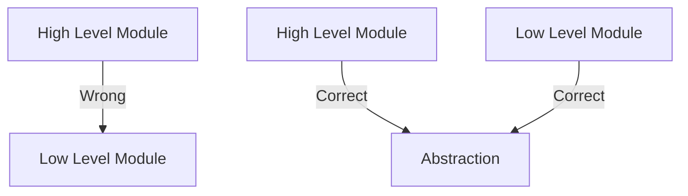
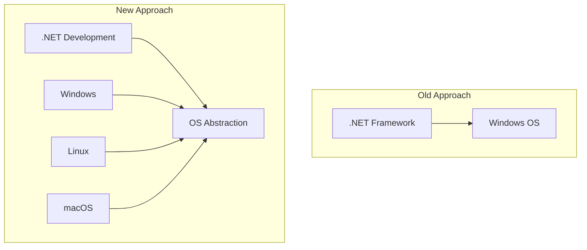
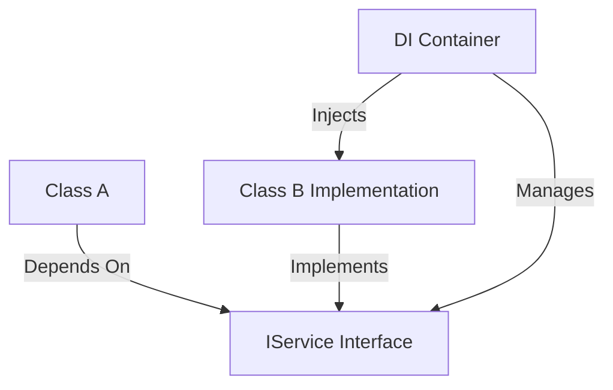

# Dependency Principles in .NET Core

## Dependency Inversion Principle (DIP)

### Core Concept
> "High-level modules should not depend on low-level modules. Both should depend on abstractions."



### Module Relationships
- A class can be both:
  - High-level module (for classes depending on it)
  - Low-level module (for classes it depends on)

### Real-World Example: .NET Evolution


| Aspect | Old .NET Framework | Modern .NET |
|--------|-------------------|-------------|
| OS Dependency | Direct Windows dependency | OS abstraction |
| Platform Support | Windows-only | Cross-platform |
| Flexibility | Limited | High |

## Dependency Injection in .NET Core

### Overview
- Built-in feature in .NET Core
- Previously required third-party solutions in .NET Framework
- Manages system component dependencies

### Service Collection
```csharp
builder.Services.AddControllers();
builder.Services.AddEndpointsApiExplorer();
builder.Services.AddSwaggerGen();
```

### How DI Works
1. **Registration**: Services are registered in `IServiceCollection`
2. **Resolution**: DI container resolves dependencies at runtime
3. **Injection**: Dependencies are automatically provided to classes

### Benefits
- Loose coupling
- Better testability
- Modular design
- Simplified dependency management

## Implementation Example Structure


### Key Principles
1. **Abstraction Dependency**
   - Classes depend on interfaces
   - Implementation details are hidden

2. **Inversion of Control**
   - Object creation handled by DI container
   - Dependencies managed externally

3. **Lifetime Management**
   - Singleton
   - Scoped
   - Transient

## Practical Benefits
1. **Maintainability**
   - Easier to modify implementations
   - Reduced coupling between components

2. **Testability**
   - Easy to mock dependencies
   - Simplified unit testing

3. **Flexibility**
   - Easy to swap implementations
   - Platform-independent code

---
**Note**: Understanding DIP is crucial before implementing DI, as it forms the theoretical foundation for dependency management in modern .NET applications.
