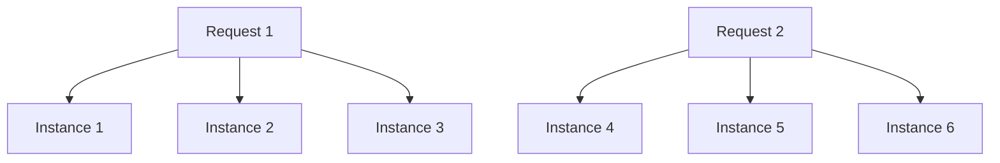
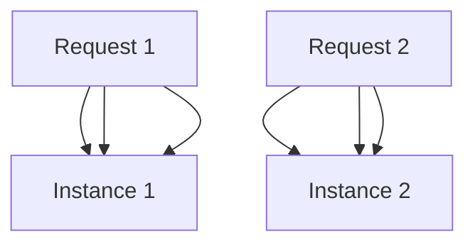
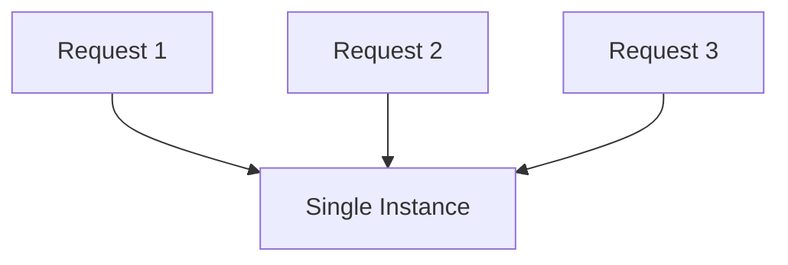
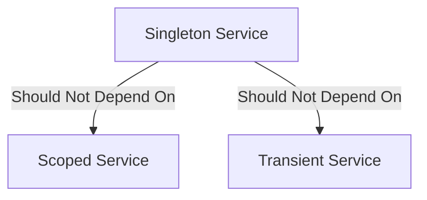

# Dependency Principles in .NET Core

## Dependency Inversion Principle (DIP)

### Core Concept
> "High-level modules should not depend on low-level modules. Both should depend on abstractions."


### Module Relationships
- A class can be both:
  - High-level module (for classes depending on it)
  - Low-level module (for classes it depends on)

### Real-World Example: .NET Evolution


| Aspect | Old .NET Framework | Modern .NET |
|--------|-------------------|-------------|
| OS Dependency | Direct Windows dependency | OS abstraction |
| Platform Support | Windows-only | Cross-platform |
| Flexibility | Limited | High |

## Dependency Injection in .NET Core

### Overview
- Built-in feature in .NET Core
- Previously required third-party solutions in .NET Framework
- Manages system component dependencies

### Service Collection
```csharp
builder.Services.AddControllers();
builder.Services.AddEndpointsApiExplorer();
builder.Services.AddSwaggerGen();
```

### How DI Works
1. **Registration**: Services are registered in `IServiceCollection`
2. **Resolution**: DI container resolves dependencies at runtime
3. **Injection**: Dependencies are automatically provided to classes

### Benefits
- Loose coupling
- Better testability
- Modular design
- Simplified dependency management

## Implementation Example Structure


### Key Principles
1. **Abstraction Dependency**
   - Classes depend on interfaces
   - Implementation details are hidden

2. **Inversion of Control**
   - Object creation handled by DI container
   - Dependencies managed externally

3. **Lifetime Management**
   - Singleton
   - Scoped
   - Transient

## Practical Benefits
1. **Maintainability**
   - Easier to modify implementations
   - Reduced coupling between components

2. **Testability**
   - Easy to mock dependencies
   - Simplified unit testing

3. **Flexibility**
   - Easy to swap implementations
   - Platform-independent code

---
**Note**: Understanding DIP is crucial before implementing DI, as it forms the theoretical foundation for dependency management in modern .NET applications.


# Practical Implementation of Dependency Injection

## Initial Setup (Without DI)

### 1. Controller Creation
```csharp
public class DevelopmentController : ControllerBase
{
    [HttpGet]
    public IActionResult Run()
    {
        var os = new WindowsOsService(); // Direct dependency - Bad practice
        var message = os.RunApp();
        return Ok(message);
    }
}
```

### 2. Service Implementation
```csharp
public class WindowsOsService
{
    public string RunApp()
    {
        return "Running from Windows";
    }
}
```

## Problem Identification


## Implementing DI Pattern

### 1. Interface Definition
```csharp
public interface IOS
{
    string RunApp();
}
```

### 2. Multiple Service Implementations
```csharp
public class WindowsOsService : IOS
{
    public string RunApp() => "Running from Windows";
}

public class MacOsService : IOS
{
    public string RunApp() => "Running from MacOS";
}

public class LinuxService : IOS
{
    public string RunApp() => "Running from Linux";
}
```

### 3. Controller with Constructor Injection
```csharp
public class DevelopmentController : ControllerBase
{
    private readonly IOS _os;

    public DevelopmentController(IOS os)
    {
        _os = os;
    }

    [HttpGet]
    public IActionResult Run()
    {
        var message = _os.RunApp();
        return Ok(message);
    }
}
```

### 4. Service Registration
```csharp
// Program.cs
builder.Services.AddScoped<IOS, WindowsOsService>();
// Or
builder.Services.AddScoped<IOS, MacOsService>();
// Or
builder.Services.AddScoped<IOS, LinuxService>();
```

## Benefits of This Approach

### 1. Dependency Inversion


### 2. Advantages Table
| Aspect | Without DI | With DI |
|--------|------------|---------|
| Coupling | Tight | Loose |
| Testability | Difficult | Easy |
| Maintainability | Poor | Good |
| Flexibility | Limited | High |

### 3. Key Benefits
1. **Easy Service Swapping**
   - Change implementation by updating registration
   - No need to modify consumer code

2. **Improved Testing**
   - Easy to mock interfaces
   - Better unit test isolation

3. **Better Maintainability**
   - Centralized service configuration
   - Reduced coupling between components

## Practical Usage

### Swagger Test Flow
1. Launch application
2. Navigate to Swagger UI
3. Locate Development controller
4. Execute GET endpoint
5. Receive 200 status code with OS-specific message

### Service Lifetime Options
```csharp
builder.Services.AddTransient<IOS, WindowsOsService>();  // New instance each time
builder.Services.AddScoped<IOS, WindowsOsService>();     // One instance per request
builder.Services.AddSingleton<IOS, WindowsOsService>();  // One instance for application
```

---
**Note**: This implementation demonstrates how DI helps follow the Dependency Inversion Principle while providing flexibility and maintainability in your application.


# Service Lifetimes in ASP.NET Core Dependency Injection

## Overview
Service lifetime determines how long an instance of a registered service remains available in an application. The dependency injection container manages these lifetimes automatically.

## Types of Service Lifetimes

### 1. Transient (⭐)
```csharp
services.AddTransient<IMyService, MyService>();
```

#### Characteristics
- New instance created each time service is requested
- Default lifetime
- Each injection gets its own instance
- Stateless services

#### Best Used For
- Lightweight services
- Stateless operations
- Services that don't share state
- Logging services



### 2. Scoped (⚪)
```csharp
services.AddScoped<IMyService, MyService>();
```

#### Characteristics
- One instance per request
- Shared within same HTTP request
- New instance for each new request
- Instance disposed after request completion

#### Best Used For
- Per-request operations
- Database contexts
- Request-specific services



### 3. Singleton (⬛)
```csharp
services.AddSingleton<IMyService, MyService>();
```

#### Characteristics
- Single instance for entire application lifetime
- Shared across all requests
- Created at first request
- Lives until application stops

#### Best Used For
- Application-wide services
- Shared resources
- Configuration services
- Caching services



## Lifetime Comparison Table

| Lifetime | Instance Creation | Scope | Best For |
|----------|------------------|-------|----------|
| Transient | Every injection | Per injection | Lightweight, stateless services |
| Scoped | Every request | Per HTTP request | Database contexts, request-specific services |
| Singleton | Once | Application-wide | Configuration, caching, shared resources |

## Performance Considerations

### Transient
- More memory usage
- Fresh instance every time
- No state sharing concerns

### Scoped
- Balanced memory usage
- State shared within request
- Most commonly used

### Singleton
- Minimal memory usage
- Application-wide state sharing
- Requires careful consideration

## Usage Guidelines

1. **Choose Transient When**:
   - Service is lightweight
   - State isolation is critical
   - Each operation needs fresh instance

2. **Choose Scoped When**:
   - Service state should persist for request
   - Database contexts needed
   - Request-level caching required

3. **Choose Singleton When**:
   - Service is expensive to create
   - Application-wide sharing needed
   - State should persist across requests

## Warning ⚠️


Careful consideration needed when:
- Using Singleton services
- Sharing state across requests
- Managing disposable resources

---
**Note**: The choice of service lifetime can significantly impact application performance and behavior. Choose based on your specific requirements and use case.
